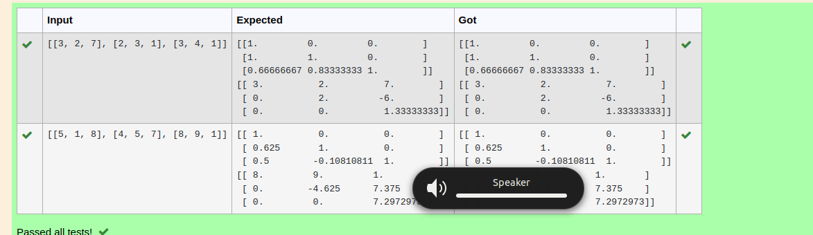
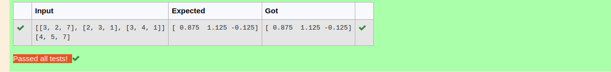

# LU Decomposition 

## AIM:
To write a program to find the LU Decomposition of a matrix.

## Equipments Required:
1. Hardware – PCs
2. Anaconda – Python 3.7 Installation / Moodle-Code Runner

## Algorithm
1. start the program
2. Enter the values
3. Display the progarm
4. End the program

## Program:
```python
(i) To find the L and U matrix
```python
Program to find L and U matrix using LU decomposition.
Developed by: Saileshkumar A
RegisterNumber: 22003843

import numpy as np
# To print L and U matrix

from scipy.linalg import lu
a=eval(input())
p,l,u=lu(a)
print(l)
print(u)
/*
Program to find the L and U matrix.
Developed by: Saileshkumar A
RegisterNumber: 

(ii) To find the LU Decomposition of a matrix
```python
Program to find the LU Decomposition of a matrix.
Developed by: Saileshkumar
RegisterNumber: 22003843
# To print X matrix (solution to the equations)
import numpy as np
from scipy.linalg import lu_factor,lu_solve
a=eval(input())
b=eval(input())
lu,piv=lu_factor(a)
x=lu_solve((lu,piv),b)
print(x)


```

## Output (i):


## output(ii)


## Result:
Thus the program to find the LU Decomposition of a matrix is written and verified using python programming.

